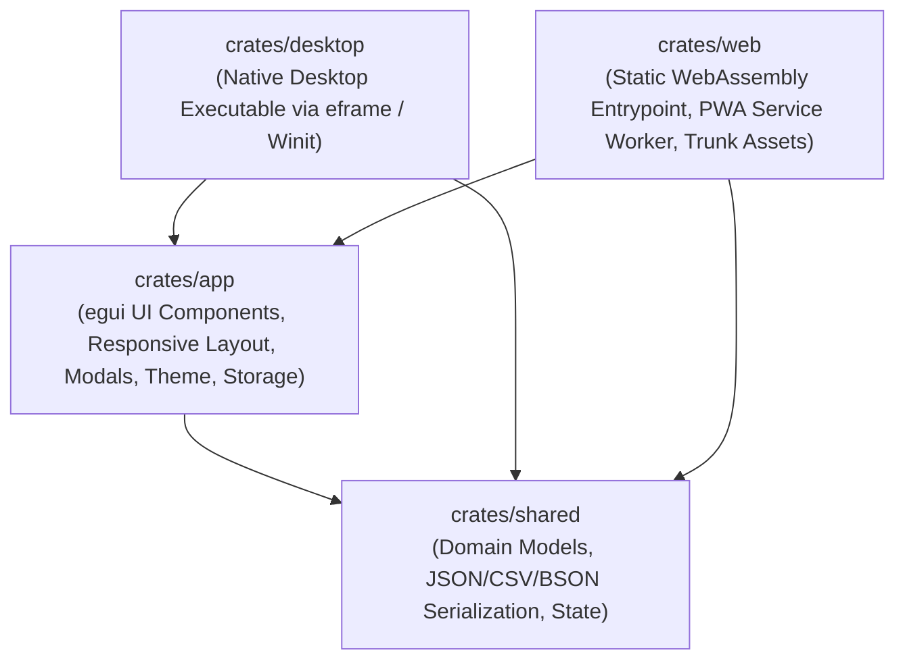

# Serverless & Desktop egui Template

[](https://github.com/Spodeian/efficient-egui-template/actions/workflows/ci.yml)
[](https://github.com/Spodeian/efficient-egui-template/actions/workflows/static.yml)
[](LICENSE)
[](https://www.rust-lang.org)
[](https://github.com/emilk/egui)
[](https://pages.cloudflare.com)

A production-ready, modular Rust & [`egui 0.36`](https://github.com/emilk/egui) / [`eframe 0.36`](https://docs.rs/eframe) template designed for high-performance **Serverless Web (WASM / Cloudflare Pages / PWA via Trunk)** and **Native Desktop (Windows, macOS, Linux via Winit)** applications.

Based directly on the proven architecture, production fixes, and deployment pipelines of [Revisited IPIP-NEO](https://github.com/Spodeian/Revisited-IPIP-NEO).

---

## 🏛️ Architectural Structure

The workspace is organized into four decoupled, single-responsibility crates:



- **[`crates/shared`](crates/shared)**: Core domain models, business logic, configuration (`ThemeMode`, `AppConfig`, `AppState`), and interchange serialization (JSON, CSV, and compressed BSON import/export).
- **[`crates/app`](crates/app)**: Modular UI view controller and layout layer powered by `egui` & `eframe`. Contains responsive design helpers (`ScreenConstraints`), the light/dark theme engine, component modules (`navbar`, `item_list`, `modals`), and persistent multi-tiered state management.
- **[`crates/desktop`](crates/desktop)**: Native runner configured with `tracing` logging and native window viewport settings.
- **[`crates/web`](crates/web)**: WebAssembly client entrypoint with `wasm-bindgen`, WebRunner initialization, and PWA / serverless assets (`index.html`, `index.css`, `index.js`, `sw.js`, `manifest.json`, `_headers`, `_redirects`).

---

## ✨ Key Features

- **⚡ Native Desktop & Serverless Web Dual-Target**: Compile identical application logic to desktop native executables (Windows, macOS, Linux) or static client-side WASM bundles for Cloudflare Pages and GitHub Pages.
- **💾 Robust Multi-Tier State Persistence**:
  - **Tier 1 (Fast Sync)**: Synchronous browser `localStorage` under dedicated storage key `serverless_template_app_state`.
  - **Tier 2 (Extended Quota)**: Asynchronous `IndexedDB` fallback if `localStorage` quota is exceeded.
  - **Dual-Format Deserializer**: Attempts JSON deserialization first, seamlessly falling back to RON for backwards and forwards compatibility.
  - **Active State Persistence**: Dispatches immediate saves on user interactions (adds, toggles, deletions, resets, imports, theme changes) in addition to window close / `beforeunload` events.
  - **Storage Diagnostics Modal**: Live inspection of persistence status (persistent vs. ephemeral) with one-click permission requests (`StorageManager.persist()`).
- **📱 Responsive & Touch-Friendly UI**: Layout automatically adapts across widescreen desktop monitors, tablets, and constrained mobile portrait viewports with adaptive element sizing and soft-wrap line calculations.
- **🎨 Theme Engine**: Instant, high-contrast toggle between Charcoal Dark Mode and Warm Light Mode with persistent preference storage.
- **⌨️ Intuitive Keyboard Support**: Press `Enter` to submit new items instantly and `Escape` to close any open modal dialog.
- **📦 Data Interchange & File Downloads**:
  - Export and import formatted **JSON**, RFC 4180-compliant **CSV**, and compact **Compressed BSON** (Zlib-compressed binary).
  - Built-in copy-to-clipboard feedback toast and direct browser file download triggers (`trigger_text_download`, `trigger_binary_download`).
- **📶 Immutable Serverless PWA Caching**: Hybrid service worker caching strategy (**Network-First** for `index.html` to guarantee atomic releases; **Cache-First** for immutable, content-hashed `.wasm`, `.js`, and `.css` assets) with offline fallback.
- **🛡️ SRI Minification Immunity**: Configured with `data-integrity="none"` in `index.html` to allow aggressive post-build asset minification (HTML, CSS, JS) without SRI hash mismatches or white screens.
- **🚀 Automated CI/CD & Deployment Pipelines**: Pre-configured for Cloudflare Pages Build System v3 (`deploy.sh`), GitHub Pages (`.github/workflows/static.yml`), and full CI test suite (`.github/workflows/ci.yml`).

---

## 🛠️ Build Requirements

- **Rust Toolchain**: Automatically managed via [`rust-toolchain.toml`](rust-toolchain.toml) (installs stable with `wasm32-unknown-unknown`).
- **Trunk Bundler**:
  ```bash
  cargo install trunk
  ```
- *(Optional)* **wasm-opt** (Binaryen v122+) for release binary size optimization.

---

## 🚀 Development Quickstart

### 1. Run Web App Locally (Trunk)
```bash
trunk serve
```
Open [http://localhost:8080](http://localhost:8080) in your browser. Live reloading is automatically enabled.

### 2. Run Native Desktop App
```bash
cargo run -p desktop
```

### 3. Run Test Suite
```bash
# Standard cargo test
cargo test --workspace

# Or with cargo-nextest (faster, parallel execution)
cargo nextest run --workspace
```

### 4. Run Static Analysis & Linter
```bash
cargo clippy --workspace --all-targets -- -D warnings
```

---

## 📦 Production Builds & Deployment

### Static Serverless WASM Bundle (Trunk)
```bash
trunk build --release
```
The optimized output assets (`index.html`, `.wasm`, `.js`, `.css`, `_headers`, `_redirects`, `sw.js`) will be located in `crates/web/dist/`.

### Cloudflare Pages (Build System v3)

Deploy directly to Cloudflare Pages using the automated build script:

```bash
bash deploy.sh
```

#### Cloudflare Pages Dashboard Settings:
- **Build System Version**: `v3` (2024/2026 build image)
- **Framework Preset**: `None` (or `Custom`)
- **Build Command**: `bash deploy.sh`
- **Build Output Directory**: `crates/web/dist`
- **Environment Variables**:
  - `RUST_VERSION`: `stable` (Optional if `rust-toolchain.toml` is present)
  - `CARGO_HOME`: `/opt/buildhome/.cargo`

#### Local Preview with Wrangler:
```bash
trunk build --release
npx wrangler pages dev crates/web/dist
```

### GitHub Pages Deployment

The repository includes a ready-to-use GitHub Actions workflow in [`.github/workflows/static.yml`](.github/workflows/static.yml) that builds, minifies, and deploys your WASM web application to GitHub Pages whenever changes are pushed to `main`.

### Native Desktop Binary
```bash
cargo build -p desktop --release
```
The compiled release executable will be located in `target/release/`.

---

## 🧩 Customizing for Your App

1. **Rename Workspace & Metadata**: Update `name`, `version`, `authors`, and `repository` in [`Cargo.toml`](Cargo.toml) and subcrate manifests.
2. **Define Domain Data**: Replace `Item` and `ItemCollection` in [`crates/shared/src/models.rs`](crates/shared/src/models.rs) with your application's domain models.
3. **Build Views & Components**: Add or update UI views in [`crates/app/src/components/`](crates/app/src/components/):
   - [`components/navbar.rs`](crates/app/src/components/navbar.rs): Header bar, navigation, and global tools.
   - [`components/item_list.rs`](crates/app/src/components/item_list.rs): Main content layout, input forms, and data cards.
   - [`components/modals.rs`](crates/app/src/components/modals.rs): Dialogs, import/export dialogs, and diagnostic panels.
4. **Update PWA & SEO Tags**: Customize `title`, meta description, OpenGraph tags, and icons in [`crates/web/index.html`](crates/web/index.html) and [`crates/web/manifest.json`](crates/web/manifest.json).

---

## 🧪 Testing & Quality Assurance

| Test Suite | Location | Purpose |
|---|---|---|
| **App Tests** | `crates/app/tests/app_tests.rs` | UI initialization, dialog state, multi-tier JSON/RON persistence |
| **Model Tests** | `crates/shared/tests/models_tests.rs` | Collection logic, JSON/CSV/BSON roundtrip, backward compatibility |
| **Desktop Smoke** | `crates/desktop/tests/smoke_tests.rs` | Desktop native options and viewport validation |
| **Web Smoke** | `crates/web/tests/smoke_tests.rs` | WebRunner app construction and wasm compatibility |

---

## 📄 License

This template is dual-licensed under [MIT](LICENSE) or Apache 2.0 at your option.
